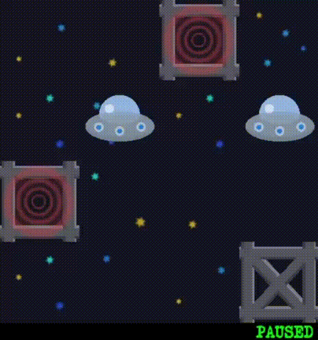
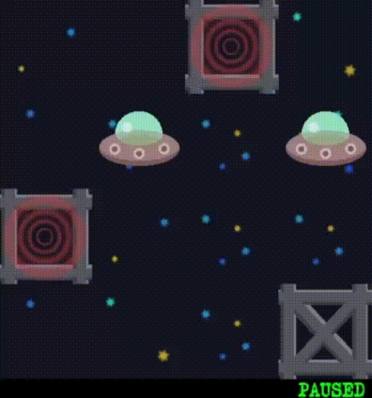
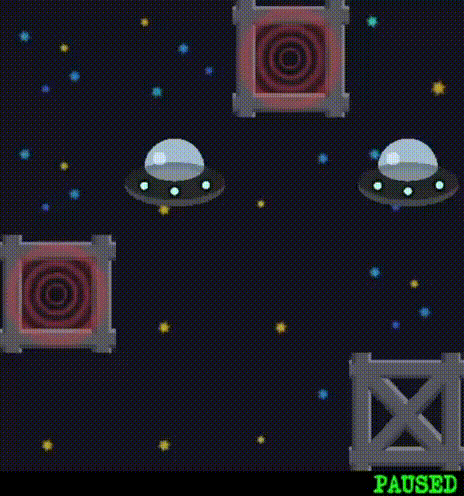
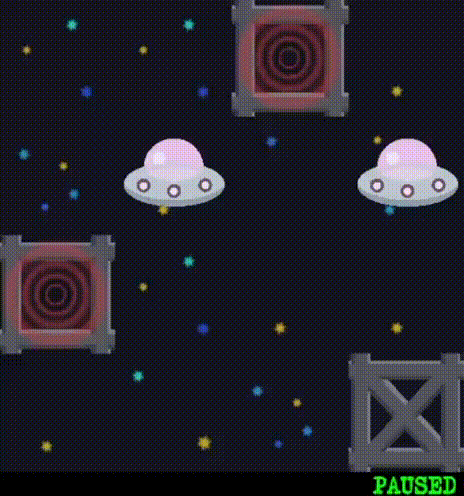

# AI Spaceship Arena 1

A pathfinding visualization project where spaceships navigate grid-based maps using various search algorithms. This project demonstrates fundamental AI search techniques including uninformed and informed search strategies.

## Description

AI Spaceship Arena 1 is a pathfinding simulator where a spaceship must navigate from its starting position to goal positions on a grid map while avoiding obstacles. The project visualizes different search algorithms solving the same pathfinding problem, allowing comparison of their efficiency and behavior.

<div align="center">

</div>

## Example

<div align="center">

</div>

## Features

- Multiple Search Algorithms: DFS, BFS, Branch & Bound, and A* implementations
- Visual Pathfinding: Watch algorithms find paths in real-time with Pygame visualization
- Custom Maps: Create and test custom grid-based maps
- Performance Comparison: Compare algorithm efficiency and path quality
- Time Limits: Optional time constraints for algorithm execution
- Detailed Logging: Track algorithm decisions and performance

## Prerequisites

- Python 3.7+
- Pygame library
- screeninfo library


## Usage

Run the pathfinding visualization with:

```bash
python main.py [algorithm] [map_file] [max_time]
```

### Parameters

- `algorithm` - Search algorithm to use: `Blue` (DFS), `Red` (BFS), `Black` (Branch&Bound), `White` (A*), or `ExampleAlgorithm` (random)
- `map_file` - Map file name from the `maps/` folder (default: `example_map.txt`)
- `max_time` - Maximum execution time in seconds (default: `0` - unlimited)

### Examples

```bash
# Run with default settings (ExampleAlgorithm - random search)
python main.py

# Use DFS algorithm
python main.py Blue

# Use A* on custom map
python main.py White custom_map.txt

# BFS with 60 second time limit
python main.py Red example_map.txt 60
```

## Search Algorithms

### ExampleAlgorithm
Random search that makes random valid moves until reaching the goal. Serves as a baseline for comparison.

### Blue (Depth-First Search)
Explores paths deeply before backtracking. Uses a stack-based approach to traverse the search space. Memory efficient but may not find the shortest path.

### Red (Breadth-First Search)
Explores all neighbors at the current depth before moving deeper. Guarantees finding the shortest path in terms of number of moves but requires more memory.

### Black (Branch & Bound)
A cost-aware search that tracks path costs and prunes branches exceeding the current best solution. Finds optimal solutions considering action costs.

### White (A* Search)
Combines actual path cost with heuristic estimates (Manhattan distance) to guide search toward the goal. Efficient and optimal when using an admissible heuristic. Ideal for finding shortest paths quickly.

## Screenshots

### DFS Algorithm Visualization

<div align="center">

</div>

### BFS Algorithm Visualization

<div align="center">

</div>

### Branch&Bound Algorithm Visualization

<div align="center">

</div>

### A* Algorithm Visualization

<div align="center">

</div>

## Map Format

Maps are text files where:
- `_` - Empty tile (navigable space)
- `O` - Obstacle (cannot pass through)
- `S` - Starting position for spaceship
- `G` - Goal position to reach

Example map:
```
__G_
_S_S
G___
___O
```

## Logging

Game logs are automatically saved in the `logs/` folder with timestamps. Each log contains detailed information about algorithm execution, paths found, and performance metrics.

## Configuration

Edit `config.py` to customize:
- Screen dimensions
- Tile sizes
- Game speed
- Colors and visual settings
